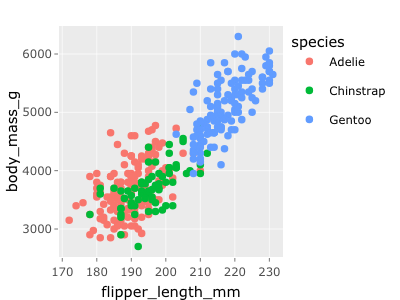
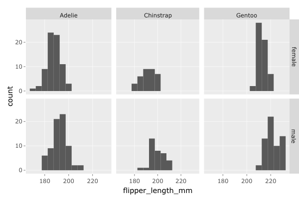
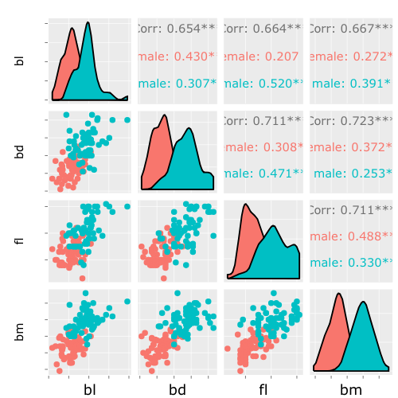

Push the `knit` button!


```{r setup, child="exercise-setup.Rmd", eval = file.exists("exercise-setup.Rmd")}
```

```{r, include = FALSE}
knitr::opts_chunk$set(
  message = FALSE,
  error = FALSE,
  warning = FALSE
  )
```

```{r pkgs, message = FALSE, warning = FALSE}
library(tidyverse) # contains ggplot2, dplyr, tidyr, etc
library(palmerpenguins)
library(plotly)
library(GGally)
```


### Exercise 1.1: Interactive scatterplot

Make a scatterplot of `flipper length` by `body_mass_g` coloured by the three `species` of penguins. Add a tooltip that labels the points by variable values and the species.


```{r part2-exercise-01-01, echo = F, class = "target"}

```

```{r part2-exercise-01-01s}
# add your code here!
```

### Exercise 1.2: Interactive histogram

Make a histogram of `flipper_length_mm` facetted by `species` and sex`, paying attention to remove the missing values. Add a tooltip that contains the count, flipper length of minimum of the bin. 

```{r part2-exercise-01-02, echo = F, class = "target"}

```

```{r part2-exercise-01-02s}
# add your code here!
```

### Exercise 1.3: Scatterplot matrix

Make a scatterplot matrix of four variables for the Gentoo penguins, coloured by sex. Pay attention to removing missing values. 

```{r part2-exercise-01-03, echo = F, class = "target"}

```

```{r part2-exercise-01-03s}
# add your code here!
```


### Exercise 1.4: Sign up for a shinyapps.io account

In preparation for lesson 3:

Sign up for an account on https://www.shinyapps.io

Authenticate your account

Install the library rsconnect (this is the part that may require admin access to your machine)

