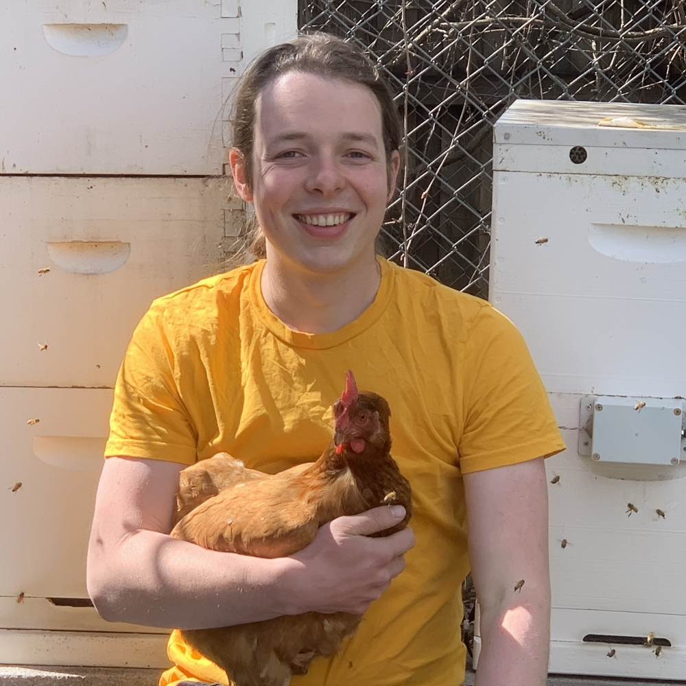

```{r, include = FALSE}
current_file <- knitr::current_input()
```
```{r titleslide, child="assets/titleslide2.Rmd"}
```

---

<div class="grid" style="grid: 1fr / 1.2fr 2fr;">
<div class="item white monash-bg-blue border-right">
<br>

<div class="circle-image">
<center>

</center>
</div>

**Di Cook** <br>
*Professor of Business Analytics*<br>
Monash University

<br>

<i class="fas fa-globe"></i> https://dicook.org/

<i class="fas fa-envelope"></i> dicook@monash.edu

<i class="fab fa-twitter"></i> @visnut

</div>

<div class="item">

<h1>About your instructor</h1>

<ul>
<li>In July 2015 I moved home to Australia after many years of education and work in the USA</li>
<li>I have been using R since it first emerged from Auckland, NZ in 1995, and I am an elected member of the R Foundation `r anicon::faa("quidditch", animate = "spin", anitype = "hover")`</li>
<li>I am one of four editors of the R Journal editorial team that publishes articles about R packages `r anicon::faa("book", animate = "tada", anitype = "hover")`</li>

<li>My main statistical application areas are sports, ecology and bioinformatics; and I like to develop new software</li>
</ul>
</div>

</div>

---


class: fullscreen

<div class="grid" style="grid: 1fr / 1.2fr 2fr;">
<div class="item white monash-bg-blue border-right">
<br>

<div class="circle-image">
<center>

</center>
</div>

**Mitchell O'Hara Wild**


<br>

.monash-white[https://www.mitchelloharawild.com]

<i class="fas fa-envelope"></i> mail@mitchelloharawild.com

<i class="fab fa-twitter"></i> @mitchoharawild

</div>

<div class="item">

<h1> About your helper </h1>


<ul>
<li> Mitchell O'Hara-Wild is a data science developer, consultant, educator, and hobbyist. 
<li> He is the lead developer of many R packages, including the tidy time series forecasting package 'fable', and R Markdown CV writing package 'vitae'. 
<li> Mitchell also teaches data analysis skills and undertakes research at Monash University in Australia. 
<li> Data also finds its way into his hobbies, to help manage the veggie patch, chickens, bees and more.
</ul>

</div>
</div>

---


class: center middle


<i class="fas fa-user-alt monash-blue font_large animated bounce"></i>

.font_large.monash-blue[Please say hello in the chat!]

<br>

What did you like most about yesterday's workshop?


---

# Schedule

<br>

Time | Activity 
:----|:---
9.00-9.45 | **Lesson 1:** Overview of tools for interactive plots
9.45-10:00 |  *Break*
10:00-10.45 | **Lesson 2:** Digging deeper into reactive elements in shiny 
10.45-11.00 | *Break*
11.00-12:00 | **Lesson 3:** Web apps to deliver effective data visualisation 

---

# Getting Started


<br><br>

.center[

.blue.font_large[<i class="fas fa-globe"></i> http://emitanaka.org/datavis-adv-workshop/]

]

<br><br><br>


.center[
.font_large[<i class="fas fa-download"></i> Click [here](https://github.com/emitanaka/datavis-adv-workshop/archive/refs/heads/master.zip) to download today's materials as a ZIP file.]
]

---

class: center

# Help me!

<br><br>

You can write in the chat.

<br>

You can ask (unmute yourself).

<br>

You can raise hand from zoom under Participants.


<br>

We'll come around in breakout sessions.


---

```{r endslide, child="assets/endslide.Rmd"}
```
