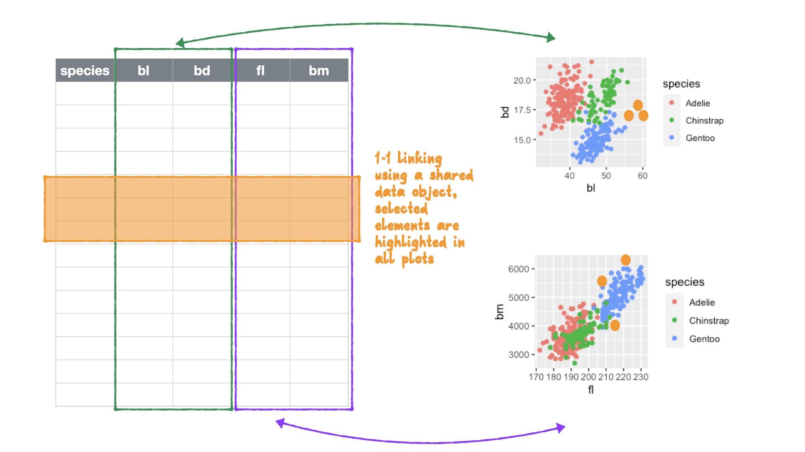

```{r, include = FALSE}
current_file <- knitr::current_input()
```
```{r titleslide, child="assets/titleslide2.Rmd"}
```
```{r, include = FALSE}
knitr::opts_chunk$set(
  fig.path = "images/day2-session1/",
  fig.width = 6,
  fig.height = 4,
  fig.align = "center",
  out.width = "100%",
  fig.retina = 3,
  warning = FALSE,
  message = FALSE,
  cache = FALSE
)
library(tidyverse)
filter <- dplyr::filter
select <- dplyr::select
library(palmerpenguins)
library(plotly)
library(crosstalk)
library(lubridate)
library(ggmap)
library(sugarbag)
library(wordcloud)
library(GGally)
library(ggthemes)
library(leaflet)
library(DT)
library(reactable)
```

---

# Click me: https://ebsmonash.shinyapps.io/VICfire/

```{r out.width="100%", echo=FALSE}
knitr::include_app("https://ebsmonash.shinyapps.io/VICfire/", height = "550px") 
```

---

# Landscape of interactive plotting packages

```{r landscape, echo=FALSE, fig.width=10, fig.height=6, out.width="90%"}
set.seed(2)
library(wordcloud)
tools <- tibble(name=c("plotly", 
                       "leaflet",
                       "crosstalk",
                       "htmlwidgets",
                       "vegawidget",
                       "rgl", 
                       "gridSVG",
                       "animint2",
                       "RJava",
                       "ggvis",
                       "rCharts",
                       "rbokeh",
                       "cranvas",
                       "loon",
                       "googleVis",
                       "epivizr",
                       "bigPint",
                       "glimma",
                       "iheatmapr",
                       "d3heatmap",
                       "heatmaply",
                       "streamgraph",
                       "chorddiag",
                       "circlepackeR",
                       "networkD3",
                       "dygraph",
                       "visNetwork",
                       "DT",
                       "reactable"), 
                weight=c(8,6,8,8,
                         1,1,1,1,1,1,1,1,1,1,1,
                         2,2,2,2,
                         1,1,1,1,1,1,1,1,
                         3,3))
wordcloud(tools$name, tools$weight, min.freq=1, colors = brewer.pal(8, "Dark2"), rot.per=0, fixed.asp = 2)
```


---
# Applying interactivity 

.top10-color-box[The purpose of interactivity is to display more than can be achieved with persistent plot elements, and to invite the reader to engage with the plot.]
--

<br><br><br><br>
.pull-left[
- .monash-blue2[Mouse-over] labels .monash-blue2[de-clutters] a plot `r anicon::nia("EASY", animate="bounce", colour="#008A25", anitype = "hover", size=1)`

- .monash-blue2[Pan/zoom] allows .monash-blue2[re-focusing] attention `r anicon::nia("EASY", animate="bounce", colour="#008A25", anitype = "hover", size=1)`

- .monash-blue2[Selection] allows .monash-blue2[focusing] attention `r anicon::nia("MODERATE", animate="bounce", colour="#D93F00", anitype = "hover", size=1)`
 
- .monash-blue2[Linking] connects elements from multiple plots `r anicon::nia("DIFFICULT", animate="bounce", colour="#EE0220", anitype = "hover", size=1)`

]

.pull-right[

- .monash-blue2[Sorting] .monash-blue2[re-orders elements], most useful for tables `r anicon::nia("EASY", animate="bounce", colour="#008A25", anitype = "hover", size=1)`

- .monash-blue2[Transforming] may be changing bin sizes in a histogram, or applying a log scale, or using a "fish eye lens" `r anicon::nia("DIFFICULT & RARE", animate="bounce", colour="#EE0220", anitype = "hover", size=1)`

]

---
# Direct manipulation vs GUI


.pull-left[

## Direct manipulation

When these actions 

- .monash-blue2[Mouse-over] 
- .monash-blue2[Pan/zoom] 
- .monash-blue2[Selection] 
- .monash-blue2[Linking] 
- .monash-blue2[Sorting] 
- .monash-blue2[Transforming] 

are taken by the user .monash-orange2[directly on the plot] itself.
]

.pull-right[
## Graphical User Interface

Elements of the plot changes are made using GUI items like sliders, checkboxes, menus 

<center>
 
</center>

]
---
class: transition middle
# Getting hands-on with plotly

---
# What is plotly?

`plotly.js` is a javascript plotting library. `plotly` is an R package with a key function `ggplotly()` that converts ggplot objects into a JSON object to be rendered in a web browser by `plotly.js`. 

<center>
 
</center>

.footnote[Figure 2.5 from Sievert (2019)]

---
class: font_smaller

# Palmer penguins

.font_small[
```{r echo=FALSE}
penguins %>% 
  DT::datatable(width=1150, height=100)
```
]

<div class="tag center animated rubberBand" style="position:absolute;top:2%;left:12%;transform:rotate(-3deg);">
demo data for today
</div>

---
# Layering interactivity to a ggplot

<br>

.left-code[
.font_small[
```{r palmer-scatter, fig.show='hide', results='hide'}
p <- ggplot(penguins, 
       aes(x = bill_length_mm, 
           y = bill_depth_mm, 
           color = species)) +
  geom_point() 

ggplotly(p) #<<
```
]

]
.right-plot[

```{r ref.label = "palmer-scatter", echo=FALSE, fig.width=5, fig.height=5, out.width="80%"}
```
]

---
# Aspect ratio, and remove legend

<br>

.left-code[
.font_small[
```{r palmer-scatter2, fig.show='hide', results='hide'}
p2 <- ggplot(penguins, 
       aes(x = bill_length_mm, 
           y = bill_depth_mm, 
           color = species)) +
  geom_point() +
  theme(legend.position="none", #<<
        aspect.ratio=1) #<<

ggplotly(p2) 
```
]

]
.right-plot[

```{r ref.label = "palmer-scatter2", echo=FALSE, fig.width=5, fig.height=5, out.width="80%"}
```
]

---
# Fix aspect ratio with ggplotly argument

<br>

.left-code[
.font_small[
```{r palmer-scatter3, fig.show='hide', results='hide'}
p3 <- ggplot(penguins, 
       aes(x = bill_length_mm, 
           y = bill_depth_mm, 
           color = species)) +
  geom_point() +
  theme(legend.position="none", 
        aspect.ratio=1) 

ggplotly(p3, width=500, height=500) #<<
```
]

]
.right-plot[

```{r ref.label = "palmer-scatter3", echo=FALSE, fig.width=5, fig.height=5, out.width="80%"}
```
]
---
# plotly features

<br>

.pull-left[
```{r palmer-scatter4, echo=FALSE, out.width="80%"}

p4 <- ggplot(penguins, 
       aes(x = bill_length_mm, 
           y = bill_depth_mm, 
           color = species)) +
  geom_point() 

ggplotly(p4, width=600, height=500) 
```
]
.pull-right[

<center>
<br><br>
pan/zoom 
<br>
<br>

legend click
<br>
<br>

brush 
</center>

]
---
# Most but not all ggplot features are supported

.left-code[
.font_small[
```{r palmer-facet, fig.show='hide', results='hide'}
p5 <- p3 + 
  facet_wrap(~species) #<<

ggplotly(p5, width=550, height=250)
```

<br><br><br><br><br><br>
```{r palmer-theme, fig.show='hide', results='hide'}
p6 <- p3 + 
  scale_color_brewer(
    palette = "Dark2") + #<<
  theme_bw() #<<

ggplotly(p6, width=400, height=300)
```

]
]

.right-plot[

```{r ref.label = "palmer-facet", echo=FALSE, fig.width=5, fig.height=5, out.width="80%"}
```

```{r ref.label = "palmer-theme", echo=FALSE, fig.width=5, fig.height=5, out.width="80%"}
```

]
---
# Most ggplot2 extensions mostly work

.left-code[
.font_small[
```{r palmer-splom, fig.show='hide', results='hide'}
library(GGally)
penguins_l <- penguins %>%
  rename(bl = bill_length_mm,
         bd = bill_depth_mm,
         fl = flipper_length_mm,
         bm = body_mass_g)
splom <- ggpairs(penguins_l, #<<
                 columns = 3:6, 
                 aes(color = species)) +
  theme(axis.text = element_blank())

ggplotly(splom, width=500, height=500)
```
]
]
.right-plot[

```{r ref.label="palmer-splom", echo=FALSE, fig.width=10, fig.height=10, out.width="60%"}
```

]
---
# Multiple plotly plots with subplot

A layout of different plots 

<br>
.left-code[
.font_small[
```{r palmer-subplot, fig.show='hide', results='hide'}

p_h <- ggplot(penguins, 
          aes(x = body_mass_g)) +
        geom_histogram()

gp_h <- ggplotly(p_h)
gp_s <- ggplotly(p3)

subplot(gp_h, #<<
        gp_s, 
        titleX = TRUE, 
        titleY = TRUE,
        margin=c(0.06, 0.06, 0, 0), #<<
        nrows = 1)
```
]
]
.right-plot[

```{r ref.label="palmer-subplot", echo=FALSE}
```

]

---
# Tooltips can be customised

.pull-left[
Custom tooltips, from the ggplot

.font_small[
```{r palmer-tooltip1}
p_tooltip <- p3 + 
  geom_point(aes(text = island)) #<<

ggplotly(p_tooltip, 
         width=300, height=300)
```
]]

.pull-right[
or in ggplotly, either aesthetics or column name in plot data

.font_small[
```{r palmer-tooltip2}
ggplotly(p_tooltip, 
         tooltip = "text", #<<
         width=300, height=300) 
```
]]

---
# Events can be turned off 

.pull-left[

.font_small[
```{r palmer-event1}
ggplotly(p3, width=400, height=400) %>% 
  style(hoverinfo = "none") #<<
```
]]

---
# Events can be propagated 


.pull-left[
Using the `highlight` function with `plotly_selected` shares the selection across views. 
<br><br>

.font_small[

```{r palmer-event2, fig.show='hide', results='hide'}
ggplotly(splom, 
         width=500, height=500) %>% 
  highlight(on = "plotly_selected") #<<

```

]

<br>
This is also a first example of .monash-blue2[linking between plots].

]
.pull-right[

```{r ref.label="palmer-event2", echo=FALSE}
```

.font_small[Brush to see how selected points are highlighted in all panels.]
]

---

# How linking works here

<center>
 
</center>

---
class: transition middle

# Interactive maps

---
# Tips for mapping

.top10-color-box[For data analysis, maps are a set of points, connected correctly to generate polygons.]

--

<br><br><br><br> Note: It is important when converting spatial objects from a mapping software to a data analysis project is .monash-blue2["thinning" the map] to make it smaller and efficient to work with. See the `rmapshapr` package to help with this.

---
# Maps operate with tooltips, too

.left-code[
.font_small[
```{r tas_read}
library(sugarbag)
library(ggthemes)
tas_tb <- fortify_sfc(tas_sa2) 
tas_map <- ggplot(tas_tb, 
  mapping = aes(x=long, lat, 
    group = interaction(SA2_5DIG16, 
                        polygon), 
     fill = AREASQKM16), 
  colour="white") +
  geom_polygon(aes(text = SA2_NAME16)) +
  scale_fill_distiller("", 
    palette="YlGnBu", direction=1) + 
  theme_map()
```

]]

.right-plot[
```{r fig.width=6, fig.height=6, out.width="100%", echo=FALSE}
tas_map
```
]

---

.left-code[
.font_small[
```{r fig.width=6, fig.height=8, out.width="100%"}
ggplotly(tas_map + 
           theme(legend.position="none"), 
         tooltip = "text")
```
]]

.right-plot[
.font_small[
```{r fig.width=6, fig.height=8, out.width="100%"}
ggplotly(tas_map + 
           theme(legend.position="none"), 
         tooltip = c("text", "fill"))
```
]]


---
# Maps with leaflet

.left-code[
.font_small[
```{r tas_leaflet, results='hide', fig.show='hide'}
library(leaflet)
leaflet(tas_sa2) %>%
  addPolygons(color = "#444444", #<<
              weight = 1, 
              smoothFactor = 0.5,
    opacity = 1.0, fillOpacity = 0.5,
    fillColor = ~colorQuantile("YlGnBu",
          c(0, max(AREASQKM16)))(AREASQKM16),
    highlightOptions = highlightOptions( #<<
      color = "white", weight = 2,
      bringToFront = TRUE))
```
]
]

.right-plot[

```{r ref.label="tas_leaflet", echo=FALSE}
```
]

---

.left-code[
.font_small[
```{r tas_leaflet2, results='hide', fig.show='hide'}
tas_labels <- sprintf(
  "<strong>%s</strong><br/>%g km<sup>2</sup>",
  tas_sa2$SA2_NAME16, tas_sa2$AREASQKM16
) %>% lapply(htmltools::HTML)

leaflet(tas_sa2) %>%
  addPolygons(color = "#444444", 
              weight = 1, 
              smoothFactor = 0.5,
    opacity = 1.0, fillOpacity = 0.5,
    fillColor = ~colorQuantile("YlGnBu",
          c(0, max(AREASQKM16)))(AREASQKM16),
    highlightOptions = highlightOptions( 
      color = "white", weight = 2,
      bringToFront = TRUE),
    label = tas_labels, #<<
    labelOptions = labelOptions(
      style = list("font-weight" = "normal",
                   padding = "3px 8px"),
    textsize = "15px",
    direction = "auto"))
```
]]

.right-plot[

<br><br><br>
```{r ref.label="tas_leaflet2", echo=FALSE}
```
]

---

# Reflection on leaflet

<br>
<br>

.pull-left[
## Advantages    

fast, scalable, reliable

many map formats 

]
--

.pull-right[
## Disadvantages

specialist syntax

limited capabilities

map is fast but overlays, like polygons are slow
]

---
# Maps as background: leaflet

.left-code[

.font_small[
```{r platy_leaflet, fig.show='hide', results='hide'}
load(here::here("data/platypus.rda"))
platypus <- platypus %>%
  filter(year(eventDate) > 2018) 
platypus %>%
  leaflet() %>%
  addTiles() %>% #<<
  addCircleMarkers( #<<
    radius = 1, opacity = 0.5, 
    color = "orange", 
    label = ~eventDate, #<<
    lat = ~Latitude, lng = ~Longitude) #<<
```
]
]

.right-plot[
```{r ref.label="platy_leaflet", echo=FALSE, fig.height=8, fig.width=8}
```

]

---
# Maps as background: ggmap/plotly

.left-code[

.font_small[
```{r platy_plotly, fig.show='hide', results='hide'}
# Use ggmap::get_map() to download an OSM
load(here::here("data/oz_map.rda"))
p <- ggmap(oz_map) + 
  geom_point(data = platypus, 
             aes(x = Longitude, 
                 y = Latitude, 
                 label=eventDate), 
             alpha = 0.5, 
             colour = "orange") + 
  theme_map()
ggplotly(p, tooltip = "label") #<<
```
]

]

.right-plot[
```{r ref.label="platy_plotly", echo=FALSE, fig.width=10, fig.height=8, fig.align="center", out.width="80%"}
```
]
---
class: transition middle

# Interactive tables

---
class: font_smaller

# Tables with DT

.font_small[
```{r}
penguins %>% 
  DT::datatable(width=1150, height=100)
```
]

---
class: font_smaller

# Tables with reactable

.font_small[
```{r echo=FALSE}
library(reactable)
reactable(penguins)
```
]
---
class: middle

More details of `reactable` can be found at https://glin.github.io/reactable/index.html

The appearance and display elements in the tables can be modified extensively.

---
class: transition middle

# Summary

We've learned basics of interactive plots, primarily using `plotly`. 

Keep in mind the variety in types of interactions.

---
# Think about

Interactive plots can be for two very different purposes. 

.pull-left[
# Exploratory

We are yet to understand what the data says. Make available as much of the data as possible, and range of interactions.  

]
.pull-right[
# Explanatory

We understand the data, and we have identified the key findings that can be communicated to the audience. Here you can optimise the choice of interactions for the best communication. 

]
---

class: exercise middle hide-slide-number


<i class="fas fa-users"></i>

# <i class="fas fa-code"></i> Open `day2-exercise-01.Rmd`

<center>
`r countdown::countdown(15, class = "clock")`
</center>

---
# Learning more

- Sievert (2019) [Interactive web-based data visualization with R, plotly, and shiny](https://plotly-r.com)
- Fidan (2020) [Guide to Creating Interactive Maps in R](https://bookdown.org/eneminef/DRR_Bookdown/)
- [RStudio's htmlwidgets gallery](http://gallery.htmlwidgets.org)
- [RStudio's crosstalk guide](https://rstudio.github.io/crosstalk/)
- R interface to javascript library DataTables, [DT](https://rstudio.github.io/DT/)
- Interactive data tables for R, based on React,  [reactable](https://glin.github.io/reactable/index.html)

---

```{r endslide, child="assets/endslide.Rmd"}
```

