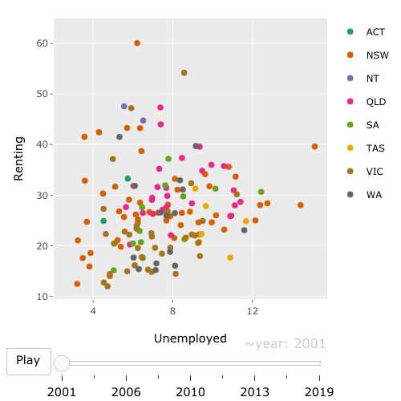
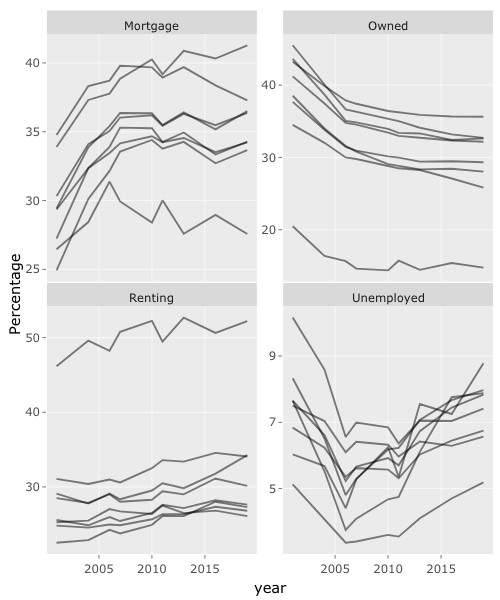

Push the `knit` button!


```{r setup, child="exercise-setup.Rmd", eval = file.exists("exercise-setup.Rmd")}
```

```{r, include = FALSE}
knitr::opts_chunk$set(
  message = FALSE,
  error = FALSE,
  warning = FALSE
  )
```

```{r pkgs, message = FALSE, warning = FALSE}
library(tidyverse) # contains ggplot2, dplyr, tidyr, etc
library(plotly)
```

Load the `abs` data with 

```{r}
load(here::here("data/abs.rda"))
```


### Exercise 1.1: Animated scatterplot

Make an animation of `Unemployed` by `Renting` over time for the `abs` data. 


```{r day2-exercise-02-01, echo = F, class = "target"}

```

```{r day2-exercise-02-01s}
# add your code here!
```

### Exercise 1.2: Linked time series

Compute the yearly average by state for each of the `abs` statistics. Make a linked multiple time series display of the four statistics.

```{r day2-exercise-02-02, echo = F, class = "target"}

```

```{r day2-exercise-02-02s}
# add your code here!
```

