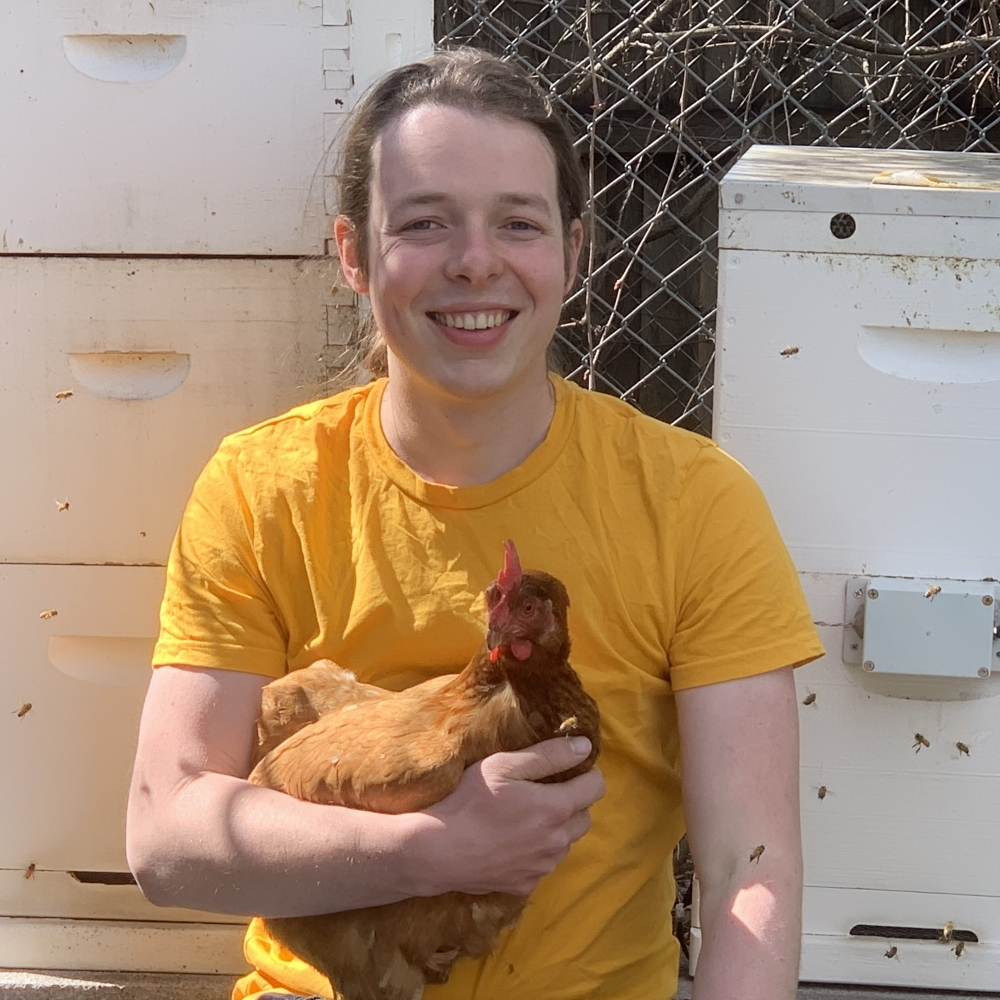

```{r, include = FALSE}
current_file <- knitr::current_input()
```
```{r titleslide, child="assets/titleslide.Rmd"}
```

---

class: fullscreen

.flex.h-100[
.pa4.w-40.monash-bg-blue.br.white[
.circle-image-200.center[

]

<br>

# Emi Tanaka
*Lecturer in Statistics*  
Monash University

<br>

<i class="fas fa-globe"></i> .monash-white[https://emitanaka.org/]

<i class="fas fa-envelope"></i> emi.tanaka@monash.edu

<i class="fab fa-twitter"></i> @statsgen

]

.pa5.w-60[

# About your instructor

* She moved to Melbourne in Jan 2020 to start her job at Monash
* She teaches R at university courses as well as use it daily for research and hobby 
* If you ever wonder who answers those stackoverflow questions, she's one of those magic fairies 

<center>
<a href="https://stackexchange/users/10113966/emi"></a>
</center>

* Her main statistical application is agriculture and bioinformatics; these days she does more software development

]]

---


class: fullscreen

.flex.h-100[
.pa4.w-40.monash-bg-blue.br.white[
.circle-image-200.center[

]

<br>

# Mitchell O'Hara Wild


<br>

<i class="fas fa-globe"></i> .monash-white[https://www.mitchelloharawild.com/]

<i class="fas fa-envelope"></i> mail@mitchelloharawild.com

<i class="fab fa-twitter"></i> @mitchoharawild

]

.pa5.w-60[

# About your helper


* Mitchell O'Hara-Wild is a data science developer, consultant, educator, and hobbyist. 
* He is the lead developer of many R packages, including the tidy time series forecasting package 'fable', and R Markdown CV writing package 'vitae'. 
* Mitchell also teaches data analysis skills and undertakes research at Monash University in Australia. 
* Data also finds its way into his hobbies, to help manage the veggie patch, chickens, bees and more.


]]


---


---

class: center middle


<i class="fas fa-user-alt monash-blue font_large animated bounce"></i>

.font_large.monash-blue[Introduce yourself in the chat!]

<br>

What's your profession?  

Where do you live?

What's your hobby? 

What's would you like for people to know about you? 


---

# Schedule

<br>

Time | Activity 
:----|:---
8.45-9.00 | Registration + Installation Help
9.00-9.45 | **Lesson 1:** Getting started & R Graphics using `grid`
9.45-10.00 |  *Break*
10.00-10.45 | **Lesson 2:**  `ggplot2` internals
10.45-11.00 |  *Break*
11.00-11.45 | **Lesson 3:** Writing `ggplot2` extensions
11.45-12.00 |  *Break*


---


# Getting Started


<br><br>

.center[

.blue.font_large[<i class="fas fa-globe"></i> http://emitanaka.org/datavis-adv-workshop/]

]

<br><br><br>


.center[
.font_large[<i class="fas fa-download"></i> Click [here](https://github.com/emitanaka/datavis-adv-workshop/archive/refs/heads/master.zip) to download today's materials as a ZIP file.]
]

---

class: center

# Help me!

<br><br>

You can write in the chat.

<br>

You can ask (unmute yourself).

<br>

You can raise hand from zoom under Participants.


<br>

We'll come around in breakout sessions.

