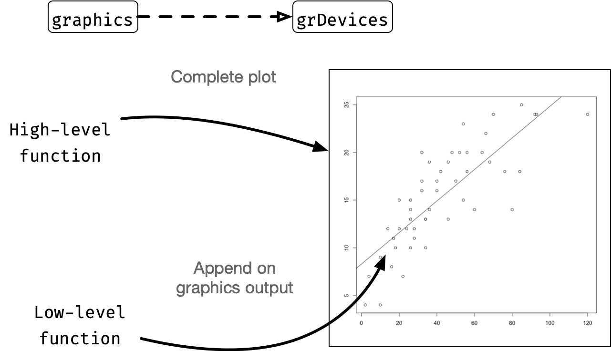
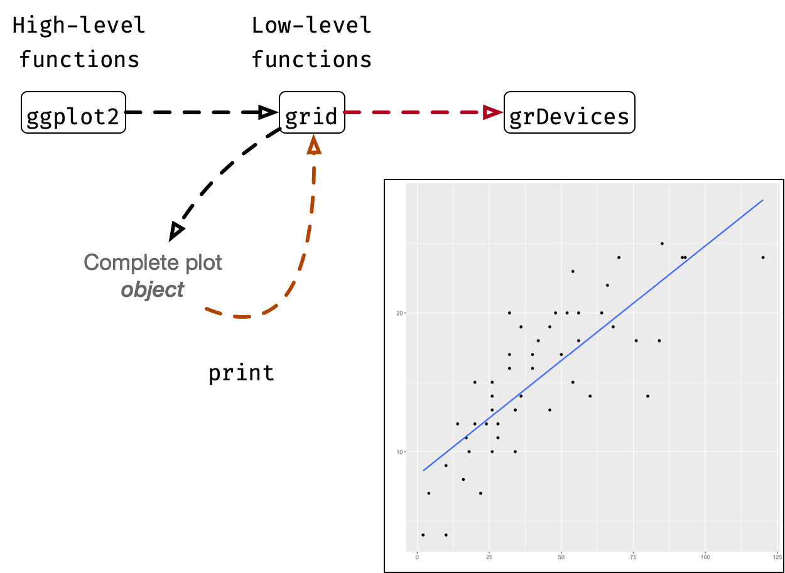
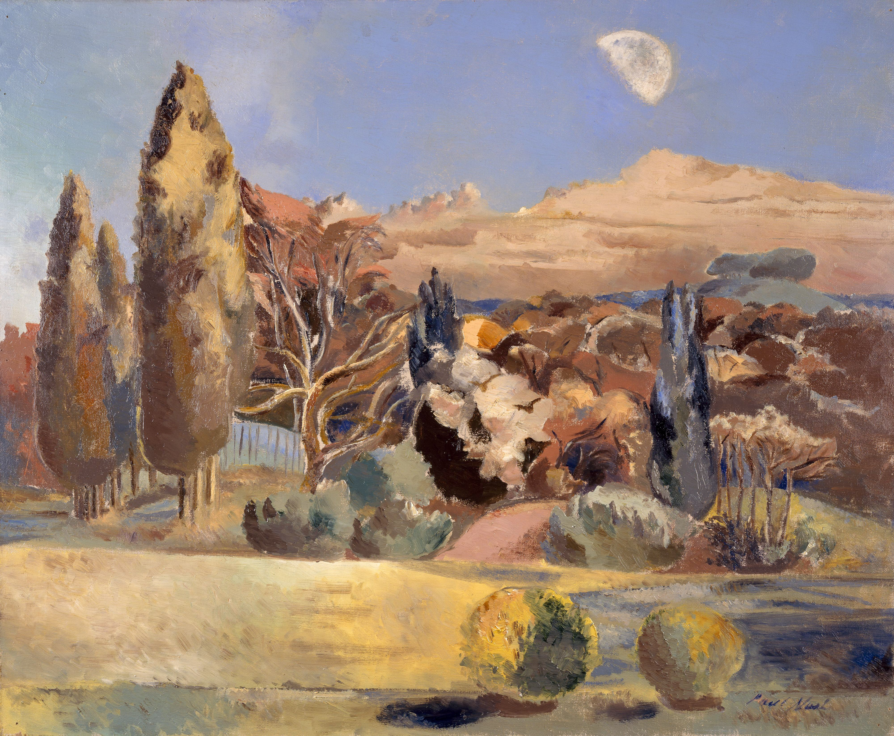

```{r, include = FALSE}
current_file <- knitr::current_input()
figpath <- paste0("images/", gsub("[.]Rmd", "", current_file), "/")
knitr::opts_chunk$set(fig.path = figpath,
                      fig.align = "center",
                      fig.retina = 2, 
                      cache = FALSE,
                      cache.path = "cache/day1-session1/")
knitr::read_chunk("grid-drawings.R")
library(grid)
```

```{r titleslide, child="assets/titleslide.Rmd"}
```

---

class: transition animated slideInLeft


# <i class="fab fa-r-project"></i> *Graphics*

.footnote[
Murrell (2019) R Graphics. CRC Press.
]

```{css, echo = FALSE}
.primitive {
  height: 80px;
  padding: 5px;
}
```

---

# R graphics system


---

# Base graphics

.center[

]

---

# `ggplot` graphics

.center[

]


---

# Graphics model in R

* There are two main **graphics models** in R

.flex[
.w-50.center[

## Base `graphics`
<br>`library(graphics)`<br> .f5[(typically already loaded)]<br><br>

]
.w-50.center[

{{content}}
]
]

--

## `grid` graphics

`library(grid)`

  
{{content}}
--

 
{{content}}
--


---

class: transition animated slideInLeft

# .monash-white[`grid`]


```{r grid-primitives, include = FALSE, fig.width = 2, fig.height = 2, dev.args=list(bg = "transparent")}
```
```{r gpars, include = FALSE, fig.width = 4, fig.height = 2}
```

---

# `grid` R-package


* The `grid` package contains the low-level functions to create, manipulate and <br>draw **gr**aphical **ob**jects (grob).
--


* The `grid` package is a **base package** and so is included in standard R installations

.f4[
```{r grid-pkg, comment=""}
packageDescription("grid") #<<
```
]


---

# Graphical objects a.k.a. "Grobs"

* The base packages `stats`, `utils`, `datasets`, `methods`, `base`, `graphics` and **`grDevices`** are automatically loaded in a standard launch of R.

```{r}
library(grid)
```

--


.flex.mt3[
.w-50.pr2[
```{r grid-circle, fig.height = 3, fig.width = 3}
grid.circle()
```

]
.w-50[
{{content}}
]
]

--

```{r grob-circle}
circleGrob()
```
{{content}}

--

```{r grob-circle-draw, fig.height = 3, fig.width = 3}
grid.draw(circleGrob())
```


---

# Graphical primitives in `grid`

.flex.mt3[
.w-20.center.mr3[
.ba[
  
`grid.lines()`  
`linesGrob()`
]]
.w-20.center.mr3[
.ba[
  
`grid.polyline()`  
`polylineGrob()`
]]
.w-20.center.mr3[
.ba[
  
`grid.segments()`
`segmentsGrob()` 
]]
.w-20.center.mr3[
.ba[
  
`grid.xspline()`  
`xsplineGrob()`
]]
.w-20.center[
.ba[
  
`grid.bezier()`  
`bezierGrob()`
]]
]
.flex.mt3[

.w-20.center.mr3[
.ba[
  
`grid.text()`  
`textGrob()`
]]
.w-20.center.mr3[
.ba[
  
`grid.raster()`  
`rasterGrob()`
]]
.w-20.center.mr3[
.ba[
  
`grid.circle()`  
`circleGrob()`
]]
.w-20.center.mr3[
.ba[
  
`grid.polygon()`  
`polygonGrob()`
]]
.w-20.center[
.ba[
  
`grid.path()`  
`pathGrob()`
]]
]

.flex.mt3[


.w-20.center.mr3[
.ba[
  
`grid.curve()`  
`curveGrob()`
]]
.w-20.center.mr3[
.ba[
  
`grid.points()` 
`pointsGrob()`
]]
.w-20.center.mr3[
.ba[
  
`grid.rect()`  
`rectGrob()`
]]
.w-20.center.mr3[
.ba[
  
`grid.roundrect()`  
`roundrectGrob()`
]]
.w-20[
Convention of function names:

`grid.`.monash-red2[`primitive`]`()`  
.monash-red2[`primitive`]`Grob()`
]
]

---

# Higher-level functions

* Most functions in `grid` are low-level functions but *selected number of higher-level functions exist*
* The output of these functions combine multiple graphical primitives 

```{r, fig.height = 3}
pushViewport(plotViewport())
pushViewport(viewport(xscale = c(0, 100)))
grid.xaxis()
```


---

# Making your own grobs from graphical primitive 


```{r grob-combined}
shape <- circleGrob(x = 0.5, y = 0.5, r = 0.5, name = "shape")
eyes <- circleGrob(x = c(0.25, 0.75), y = 0.5, r = 0.05, 
                   gp = gpar(fill = "black"), name = "eyes")
mouth <- circleGrob(x = 0.5, y = 0.2, r = 0.1, name = "mouth")
```
--

```{r grob-combined2}
face1 <- gList(shape, eyes, mouth)
face2 <- grobTree(shape, eyes, mouth, name = "face")
```

--

.flex.mt2[
.w-20.f4.pr3[
```{r grob-combined-draw1, fig.height = 3, fig.width = 3}
grid.draw(face1)
```

]
.w-20.pr3.f4[
```{r grob-combined-draw2, fig.height = 3, fig.width = 3}
grid.draw(face2)
```

]
.w-20.f4.pr3[
```{r grob-comb-1}
grid.ls(face1)
grid.ls(face2)
```

]
.w-40.f4[
{{content}}
]
]

--

```{r grob-class}
class(face1)
class(face2)
```

---

# Basic creators of grobs

.flex[
.w-50.pr3[
* Drawing details for graphical primitives are written in C
```{r grob, fig.width = 2, fig.height=2}
g1 <- grob(x = unit(0.5, "npc"), 
           y = unit(0.5, "npc"), 
           r = unit(0.5, "npc"), 
           cl = "circle")
grid.draw(g1)
```
* You likely won't ever use this approach
]
.w-50[
{{content}}
]
]

--

* Creating a flexible tree structure with grobs 
```{r gtree, fig.width = 2, fig.height=2}
g2 <- gTree(children = gList(shape, 
                             eyes, 
                             mouth))
grid.draw(g2)
```

{{content}}

--

* Note: `grobTree(x)` is essentially `gTree(children = x)`


---

# Working with graphical outputs

<br>

Work with output | Work with grobs | Description
--- | --- | ---
`grid.get()` | `getGrob()` | Return a copy of grobs
`grid.edit()` | `editGrob()` | Modifies grobs
`grid.add()` | `addGrob()` | Add a grob
`grid.remove()` | `removeGrob()` | Remove grobs
`grid.set()` | `setGrob()` | Replace grobs


Along with some other helpful functions like :

* `grid.newpage()` to erase current device or move to a new page
* `grid.grep()` to find all matching grobs 

---

# Working with graphical outputs in action

.flex[
.w-50.pr3[
```{r face-with-no-mouth, fig.height = 3, fig.width = 3}
grid.ls(face2)

grid.draw(removeGrob(face2, "mouth"))

```
]
.w-50[
{{content}}
]
]

--

```{r}
xaxis <- xaxisGrob()
```

{{content}}

--

```{r}
grid.ls(xaxis)
```

* This should include primitives?

{{content}}

--

* The `xaxis` contains no children 
* This is because the tick marks are only drawn when signalled to draw

{{content}}

--

```{r, fig.show="hold"}
xaxisf <- grid.force(xaxis)
grid.ls(xaxisf)
```


---

# Graphical parameters in `grid`


.flex.mt2[
.w-20.center.mr2[
.ba[
  
`col`  
color
]]
.w-20.center.mr2[
.ba[
  
`fill`  
fill
]]
.w-20.center.mr2[
.ba[
  
`alpha`  
opacity
]]
.w-20.center.mr2[
.ba[
  
`lwd`  
line width
]]
.w-20.center[
.ba[
  
`lex`  
line width expansion
]]

]

.flex.mt2[
.w-20.center.mr2[
.ba[
  
`lty`  
line type
]]
.w-20.center.mr2[
.ba[
  
`lineend`  
line end style
]]
.w-20.center.mr2[
.ba[
  
`linejoin`  
line join style
]]
.w-20.center.mr2[
.ba[
  
`linemitre`  
line mitre limit
]]
.w-20[
All graphical primitives have a `gp` argument to parse with `grid::gpar()`

]]

.flex.mt2[
.w-20.center.mr2[
.ba[
  
`cex`  
character expansion
]]
.w-20.center.mr2[
.ba[
  
`fontsize`  
font size
]]
.w-20.center.mr2[
.ba[
  
`fontface`  
font face
]]
.w-20.center.mr2[
.ba[
  
`fontfamily`  
font family
]]
.w-20.center[
.ba[
  
`lineheight`  
line height
]]

]

---

class: transition animated slideInLeft

# Coodinate systems

---

# The canvas

<br>
```{r vp-root, echo = FALSE, fig.width = 8, fig.height = 6, out.extra="class='ba'", fig.align="center"}
grid.newpage()
grid.null()
```


---

# Coordinate systems

```{r coordinate, echo = FALSE}
library(magrittr)
data.frame(system = c('<code class="monash-black f4">"native"</code>', 
                      '<code class="monash-black f4">"npc"</code>', 
                      '<code class="monash-black f4">"snpc"</code>', 
                      '<code class="monash-black f4">"in"</code>, <code class="monash-black f4">"cm"</code>, <code class="monash-black f4">"mm"</code>',
                      '<code class="monash-black f4">"pt"</code>, <code class="monash-black f4">"bigpts"</code>, <code class="monash-black f4">"picas"</code>,<br> <code class="monash-black f4">"dida"</code>, <code class="monash-black f4">"cicero"</code>, <code class="monash-black f4">"scaledpts"</code>',
                      '<code class="monash-black f4">"char"</code>',
                      '<code class="monash-black f4">"line"</code>',
                      '<code class="monash-black f4">"strwidth"</code>, <code class="monash-black f4">"strheight"</code>',
                      '<code class="monash-black f4">"grobx"</code>, <code class="monash-black f4">"groby"</code>',
                      '<code class="monash-black f4">"grobwidth"</code>, <code class="monash-black f4">"grobheight"</code>'),
           desc = c("Relative to the scales of the current viewport",
                    "Normalised parent coordinates",
                    "Square normalised parent coordinates",
                    "Physical inches, centimeters, millimeters",
                    "72.27 points = 1 inch, 72 big points = 1 inch, 12 points = 1 pica,<br> 1157 dida = 1248 points, 1 cicero = 12 dida, 65536 scaled points = 1 point",
                    "Multiples of the current font size <span class='f5'>(<code class='monash-black f4'>fontsize</code> and <code class='monash-black f4'>cex</code>)</span>",
                    "Multiples of the height of a text line <span class='f5'>(<code class='monash-black f4'>fontsize</code>, <code class='monash-black f4'>cex</code> and <code class='monash-black f4'>lineheight</code>)</span>",
                    "Multiples of the width/height of a given string <span class='f5'>(<code class='monash-black f4'>fontsize</code>, <code class='monash-black f4'>cex</code>, <code class='monash-black f4'>fontfamily</code>, and <code class='monash-black f4'>fontface</code>)</span>",
                    "Multiples of the x- and y-location on the boundary of a given grob",
                    "Multiples of the width/height of a given grob")) %>% 
  knitr::kable(escape = FALSE, col.names = c("Coordinate system", "Description")) %>% 
  kableExtra::kable_classic(full_width = FALSE)
```


---

# Drawing with `grid` .circle.monash-bg-white.monash-blue[1]

.flex[
.w-50[
```{r vp-rect1, eval = FALSE, echo = 1:8}
grid.rect(x = 0, 
          y = 0, 
          width = 0.25, 
          height = 0.25, 
          default.units = "npc",
          just = c("left", "bottom"), 
          gp = gpar(fill = "pink"),
          vp = NULL)
grid.polyline(x = c(0.25, 0.25, 0.5, 0.5, 0.75, 0.75),
          y = c(0, 1, 0, 1, 0, 1),
          id.lengths = rep(2, 3),
          gp = gpar(lty = "dashed", col = "gray"))
grid.polyline(x = c(0, 1, 0, 1, 0, 1),
          y = c(0.25, 0.25, 0.5, 0.5, 0.75, 0.75),
          id.lengths = rep(2, 3),
          gp = gpar(lty = "dashed", col = "gray"))
```

]
.w-50[
```{r vp-rect1, echo = FALSE, fig.width = 7, fig.height = 5, out.extra="class='ba'", fig.align="center"}
```
.f4[
* The grid lines are drawn for your convenience
]


]
]

---

# Drawing with `grid` .circle.monash-bg-white.monash-blue[2]

.flex[
.w-50[
```{r vp-rect2, eval = FALSE, echo = 1:8}
grid.rect(x = 0.5, #<<
          y = 0.5, #<<
          width = 0.25, 
          height = 0.25, 
          default.units = "npc",
          just = c("left", "bottom"), 
          gp = gpar(fill = "pink"),
          vp = NULL)
grid.polyline(x = c(0.25, 0.25, 0.5, 0.5, 0.75, 0.75),
          y = c(0, 1, 0, 1, 0, 1),
          id.lengths = rep(2, 3),
          gp = gpar(lty = "dashed", col = "gray"))
grid.polyline(x = c(0, 1, 0, 1, 0, 1),
          y = c(0.25, 0.25, 0.5, 0.5, 0.75, 0.75),
          id.lengths = rep(2, 3),
          gp = gpar(lty = "dashed", col = "gray"))
```

]
.w-50[
```{r vp-rect2, echo = FALSE, fig.width = 7, fig.height = 5, out.extra="class='ba'", fig.align="center"}
```

]
]

---


# Drawing with `grid` .circle.monash-bg-white.monash-blue[3]

.flex[
.w-50[
```{r vp-rect3, eval = FALSE, echo = -c(1:8)}
grid.polyline(x = c(0.25, 0.25, 0.5, 0.5, 0.75, 0.75),
          y = c(0, 1, 0, 1, 0, 1),
          id.lengths = rep(2, 3),
          gp = gpar(lty = "dashed", col = "gray"))
grid.polyline(x = c(0, 1, 0, 1, 0, 1),
          y = c(0.25, 0.25, 0.5, 0.5, 0.75, 0.75),
          id.lengths = rep(2, 3),
          gp = gpar(lty = "dashed", col = "gray"))
grid.rect(x = 0.5, 
          y = 0.5, 
          width = 0.25, 
          height = 0.25, 
          default.units = "npc",
          just = c("center", "center"), #<<
          gp = gpar(fill = "pink"),
          vp = NULL)
```
]
.w-50[
```{r vp-rect3, echo = FALSE, fig.width = 7, fig.height = 5, out.extra="class='ba'", fig.align="center"}
```

]
]

---

# Drawing with `grid` .circle.monash-bg-white.monash-blue[4]

.flex[
.w-50[
```{r vp-rect4, eval = FALSE, echo = -c(1:8)}
grid.polyline(x = c(0.25, 0.25, 0.5, 0.5, 0.75, 0.75),
          y = c(0, 1, 0, 1, 0, 1),
          id.lengths = rep(2, 3),
          gp = gpar(lty = "dashed", col = "gray"))
grid.polyline(x = c(0, 1, 0, 1, 0, 1),
          y = c(0.25, 0.25, 0.5, 0.5, 0.75, 0.75),
          id.lengths = rep(2, 3),
          gp = gpar(lty = "dashed", col = "gray"))
grid.rect(x = 0.5, 
          y = 0.5, 
          width = 0.5, #<<
          height = 0.5, #<<
          default.units = "npc",
          just = c("center", "center"), 
          gp = gpar(fill = "pink"),
          vp = NULL)
```
]
.w-50[
```{r vp-rect4, echo = FALSE, fig.width = 7, fig.height = 5, out.extra="class='ba'", fig.align="center"}
```

]
]

---

# Drawing with `grid` .circle.monash-bg-white.monash-blue[5]

.flex[
.w-50[
```{r vp-rect5, eval = FALSE, echo = -c(1:10)}
grid.polyline(x = rep(0:7, each = 2),
              y = rep(c(0, 5), times = 8),
              default.units = "in",
              id.lengths = rep(2, 8), 
              gp = gpar(lty = "dashed", col = "gray", alpha = 1))
grid.polyline(y = rep(seq(0, 5, 1), each = 2),
              x = rep(c(0, 7), times = 6),
              default.units = "in",
              id.lengths = rep(2, 6), 
              gp = gpar(lty = "dashed", col = "gray", alpha = 1))
grid.rect(x = 0.5, 
          y = 0.5, 
          width = 0.5, 
          height = 0.5, 
          default.units = "in", #<<
          just = c("left", "bottom"), 
          gp = gpar(fill = "pink"),
          vp = NULL)
```
]
.w-50[
```{r vp-rect5, echo = FALSE, fig.width = 7, fig.height = 5, out.extra="class='ba'", fig.align="center"}
```
.center[
This canvas is 5 inches high and 7 inches wide

]

]
]

---

# Drawing with `grid` .circle.monash-bg-white.monash-blue[6]

.flex[
.w-50[
```{r vp-rect6, eval = FALSE, echo = -c(1:10)}
grid.polyline(x = rep(0:7, each = 2),
              y = rep(c(0, 5), times = 8),
              default.units = "in",
              id.lengths = rep(2, 8), 
              gp = gpar(lty = "dashed", col = "gray", alpha = 1))
grid.polyline(y = rep(seq(0, 5, 1), each = 2),
              x = rep(c(0, 7), times = 6),
              default.units = "in",
              id.lengths = rep(2, 6), 
              gp = gpar(lty = "dashed", col = "gray", alpha = 1))
grid.rect(x = unit(0.5, "npc"), #<<
          y = unit(0.5, "npc"), #<<
          width = 0.5, 
          height = 0.5, 
          default.units = "in", 
          just = c("left", "bottom"), 
          gp = gpar(fill = "pink"),
          vp = NULL)
```
]
.w-50[
```{r vp-rect6, echo = FALSE, fig.width = 7, fig.height = 5, out.extra="class='ba'", fig.align="center"}
```
]]

---

# Drawing with `grid` .circle.monash-bg-white.monash-blue[7]

.flex[
.w-50[
```{r vp-rect7, eval = FALSE, echo = -c(1:11)}
set.seed(5)
grid.polyline(x = rep(0:7, each = 2),
              y = rep(c(0, 5), times = 8),
              default.units = "in",
              id.lengths = rep(2, 8), 
              gp = gpar(lty = "dashed", col = "gray", alpha = 1))
grid.polyline(y = rep(seq(0, 5, 1), each = 2),
              x = rep(c(0, 7), times = 6),
              default.units = "in",
              id.lengths = rep(2, 6), 
              gp = gpar(lty = "dashed", col = "gray", alpha = 1))
grid.circle(
  x = 1:6,
  y = 3,
  r = 1:6/6,
  default.units = "in", 
  gp = gpar(fill = sample(colors(), 6)),
  vp = NULL)
```
]
.w-50[
```{r vp-rect7, echo = FALSE, fig.width = 7, fig.height = 5, out.extra="class='ba'", fig.align="center"}
```

* Arguments can be vectorised
* The Z-order is determined by the order of the input

]]

---

class: transition animated slideInLeft

# Viewport


---

# The root viewport

* A **viewport** is a polygon (often rectangular) viewing region in computer graphics.
* When `vp = NULL`, this refers to the root viewport, i.e. the canvas

```{r vp-root2, fig.width = 7, fig.height=5, echo = FALSE}
grid.rect()
```

---

# Viewport in `grid` .circle.monash-bg-white.monash-blue[1]

.flex[
.w-50[
```{r vp1, eval = FALSE, echo = -c(1:10)}
grid.polyline(x = rep(seq(0, 1, 0.1), each = 2),
              y = rep(c(0, 1), times = 11),
              default.units = "npc",
              id.lengths = rep(2, 11), 
              gp = gpar(lty = "dashed", col = "gray", alpha = 1))
grid.polyline(y = rep(seq(0, 1, 0.1), each = 2),
              x = rep(c(0, 1), times = 11),
              default.units = "npc",
              id.lengths = rep(2, 11), 
              gp = gpar(lty = "dashed", col = "gray", alpha = 1))
grid.circle(x = c(0.1, 0.9),
            y = c(0.1, 0.9),
            r = 0.2,
            default.units = "npc", 
            gp = gpar(fill = "pink"),
            vp = NULL)
```
]
.w-50[
```{r vp1, echo = FALSE, fig.width = 7, fig.height = 5, out.extra="class='ba'", fig.align="center"}
```

Graphical output outside of the root Viewport are not visible.

]]

---

# Viewport in `grid` .circle.monash-bg-white.monash-blue[2]

.flex[
.w-50[
```{r vp2, eval = FALSE, echo = -c(1:11)}
grid.polyline(x = rep(seq(0, 1, 0.1), each = 2),
              y = rep(c(0, 1), times = 11),
              default.units = "npc",
              id.lengths = rep(2, 11), 
              gp = gpar(lty = "dashed", col = "gray", alpha = 1))
grid.polyline(y = rep(seq(0, 1, 0.1), each = 2),
              x = rep(c(0, 1), times = 11),
              default.units = "npc",
              id.lengths = rep(2, 11), 
              gp = gpar(lty = "dashed", col = "gray", alpha = 1))

vp1 <- viewport(x = 0.1, y = 0.1, #<<
        width = 0.5, #<<
        height = 0.5,  #<<
        just = c("left", "bottom")) #<<

grid.circle(x = c(0.1, 0.9),
            y = c(0.1, 0.9),
            r = 0.2,
            default.units = "npc", 
            gp = gpar(fill = "pink"),
            vp = vp1) #<<
```
]
.w-50[
```{r vp2, echo = FALSE, fig.width = 7, fig.height = 5, out.extra="class='ba'", fig.align="center"}
```

Graphical object is drawn relative to Viewport `vp1`.

]]

---

count: false

# Viewport in `grid` .circle.monash-bg-white.monash-blue[2]

.flex[
.w-50[
```{r vp3, eval = FALSE, echo = c(11:21)}
grid.polyline(x = rep(seq(0, 1, 0.1), each = 2),
              y = rep(c(0, 1), times = 11),
              default.units = "npc",
              id.lengths = rep(2, 11), 
              gp = gpar(lty = "dashed", col = "gray", alpha = 1))
grid.polyline(y = rep(seq(0, 1, 0.1), each = 2),
              x = rep(c(0, 1), times = 11),
              default.units = "npc",
              id.lengths = rep(2, 11), 
              gp = gpar(lty = "dashed", col = "gray", alpha = 1))
vp1 <- viewport(x = 0.1, y = 0.1, #<<
        width = 0.5, #<<
        height = 0.5,  #<<
        just = c("left", "bottom")) #<<

grid.circle(x = c(0.1, 0.9),
            y = c(0.1, 0.9),
            r = 0.2,
            default.units = "npc", 
            gp = gpar(fill = "pink"),
            vp = vp1) #<<

grid.rect(vp = vp1, 
  x = 0.5, y = 0.5, just = "center",
  width = 1, height = 1,
  gp = gpar(fill = "transparent", 
            lty = "dotted", 
            col = "red",
            lwd = 5))
grid.polyline(x = rep(seq(0, 1, 0.1), each = 2),
              y = rep(c(0, 1), times = 11),
              default.units = "npc",
              id.lengths = rep(2, 11), vp = vp1, 
              gp = gpar(lty = "dashed", col = "red", alpha = 1))
grid.polyline(y = rep(seq(0, 1, 0.1), each = 2),
              x = rep(c(0, 1), times = 11),
              default.units = "npc",
              id.lengths = rep(2, 11), vp = vp1, 
              gp = gpar(lty = "dashed", col = "red", alpha = 1))
grid.circle(x = c(0.1, 0.9),
            y = c(0.1, 0.9),
            r = 0.01,
            default.units = "npc", 
            gp = gpar(fill = "black"),
            vp = vp1)
```
]
.w-50[
```{r vp3, echo = FALSE, fig.width = 7, fig.height = 5, out.extra="class='ba'", fig.align="center"}
```

Graphical object is drawn relative to Viewport `vp1`.

]]

---

# Viewport in `grid` .circle.monash-bg-white.monash-blue[3]

.flex[
.w-50[
```{r vp4, eval = FALSE}
vp2 <- viewport(x = 0.5, y = 0.5, 
        width = 0.5, 
        height = 0.5,  
        just = "center", 
        angle = 30) 
grid.rect(vp = vp2)
```

]
.w-50[
```{r vp4, echo = FALSE, fig.width = 7, fig.height = 5, out.extra="class='ba'", fig.align="center"}
```

]
]

---

count: false

# Viewport in `grid` .circle.monash-bg-white.monash-blue[3]

.flex[
.w-50[
```{r vp5, eval = FALSE}
vp2 <- viewport(x = 0.5, y = 0.5, 
        width = 0.5, 
        height = 0.5,  
        just = "center", 
        angle = 30) 
grid.rect(vp = vp2)
pushViewport(vp2) #<<
```

]
.w-50[
```{r vp5, echo = FALSE, fig.width = 7, fig.height = 5, out.extra="class='ba'", fig.align="center"}
```

* `pushViewport(vp)` changes all subsequent drawing context to the `viewport` object `vp`
]
]

---

count: false

# Viewport in `grid` .circle.monash-bg-white.monash-blue[3]

.flex[
.w-50[
```{r vp6, eval = FALSE}
vp2 <- viewport(x = 0.5, y = 0.5, 
        width = 0.5, 
        height = 0.5,  
        just = "center", 
        angle = 30) 
grid.rect(vp = vp2)
pushViewport(vp2) #<<
grid.rect(vp = vp2)
```

]
.w-50[
```{r vp6, echo = FALSE, fig.width = 7, fig.height = 5, out.extra="class='ba'", fig.align="center"}
```
* `pushViewport(vp)` changes all subsequent drawing context to the `viewport` object `vp`
]
]

---

count: false

# Viewport in `grid` .circle.monash-bg-white.monash-blue[3]

.flex[
.w-50[
```{r vp7, eval = FALSE}
vp2 <- viewport(x = 0.5, y = 0.5, 
        width = 0.5, 
        height = 0.5,  
        just = "center", 
        angle = 30) 
grid.rect(vp = vp2)
pushViewport(vp2) #<<
grid.rect(vp = vp2)
pushViewport(vp2) #<<
```

]
.w-50[
```{r vp7, echo = FALSE, fig.width = 7, fig.height = 5, out.extra="class='ba'", fig.align="center"}
```
* `pushViewport(vp)` changes all subsequent drawing context to the `viewport` object `vp`
]
]

---

count: false

# Viewport in `grid` .circle.monash-bg-white.monash-blue[3]

.flex[
.w-50[
```{r vp8, eval = FALSE}
vp2 <- viewport(x = 0.5, y = 0.5, 
        width = 0.5, 
        height = 0.5,  
        just = "center", 
        angle = 30) 
grid.rect(vp = vp2)
pushViewport(vp2) #<<
grid.rect(vp = vp2)
pushViewport(vp2) #<<
grid.rect(vp = vp2)
```

]
.w-50[
```{r vp8, echo = FALSE, fig.width = 7, fig.height = 5, out.extra="class='ba'", fig.align="center"}
```
* `pushViewport(vp)` changes all subsequent drawing context to the `viewport` object `vp`
]
]

---

count: false

# Viewport in `grid` .circle.monash-bg-white.monash-blue[3]

.flex[
.w-50[
```{r vp9, eval = FALSE}
vp2 <- viewport(x = 0.5, y = 0.5, 
        width = 0.5, 
        height = 0.5,  
        just = "center", 
        angle = 30) 
grid.rect(vp = vp2)
pushViewport(vp2) #<<
grid.rect(vp = vp2)
pushViewport(vp2) #<<
grid.rect(vp = vp2)
popViewport() #<<
```

]
.w-50[
```{r vp9, echo = FALSE, fig.width = 7, fig.height = 5, out.extra="class='ba'", fig.align="center"}
```
* `pushViewport(vp)` changes all subsequent drawing context to the `viewport` object `vp`
* `popViewport()` removes current viewport and reverts to the previous drawing context
]
]

---

count: false

# Viewport in `grid` .circle.monash-bg-white.monash-blue[3]

.flex[
.w-50[
```{r vp10, eval = FALSE}
vp2 <- viewport(x = 0.5, y = 0.5, 
        width = 0.5, 
        height = 0.5,  
        just = "center", 
        angle = 30, name = "vp-2") 
grid.rect(vp = vp2)
pushViewport(vp2) #<<
grid.rect(vp = vp2)
pushViewport(vp2) #<<
grid.rect(vp = vp2)
popViewport() #<<
grid.text("Bottom-left corner", 
          x = 0.025, y = 0.025, 
          just = c("left", "bottom"))
```

]
.w-50[
```{r vp10, echo = FALSE, fig.width = 7, fig.height = 5, out.extra="class='ba'", fig.align="center"}
```
* `pushViewport(vp)` changes all subsequent drawing context to the `viewport` object `vp`
* `popViewport()` removes current viewport and reverts to the previous drawing context

]
]

---

# Viewport in `grid` .circle.monash-bg-white.monash-blue[4]

.flex[
.w-50.f4[
```{r vp11, eval = FALSE}
vp3 <- viewport(x = 0.5, y = 0.5, 
        width = 0.5, 
        height = 0.5,  
        just = "center", 
        angle = 30, name = "vp-3") 
grid.rect(vp = vp2)
pushViewport(vp2) 
grid.rect(vp = vp2)
pushViewport(vp3)
grid.rect(vp = vp2)
upViewport(n = 2) #<<
grid.text("Bottom-left corner", 
          x = 0.025, y = 0.025, 
          just = c("left", "bottom"))
downViewport("vp-3") #<<
grid.text("Bottom-left corner", 
          x = 0.025, y = 0.025, 
          just = c("left", "bottom"))
```

]
.w-50[
```{r vp11, echo = FALSE, fig.width = 7, fig.height = 5, out.extra="class='ba'", fig.align="center"}
```
* `upViewport()` 
* `downViewport()` 

]
]


---


class: transition 

# Resources


.f2[See Murrell (2019) "R Graphics" book for more about .monash-white[`grid`]]


---

class: exercise middle hide-slide-number


<i class="fas fa-users"></i>

# <i class="fas fa-code"></i> Open `day1-exercise-01.Rmd`

<center>
`r countdown::countdown(15, class = "clock")`
</center>


---

```{r endslide, child="assets/endslide.Rmd"}
```
