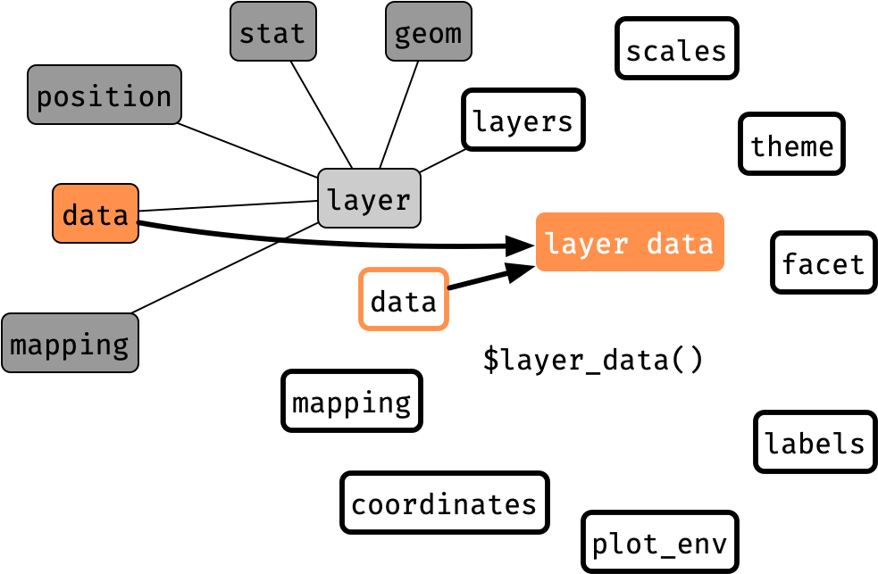
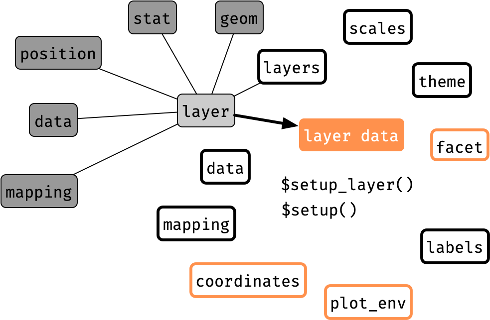
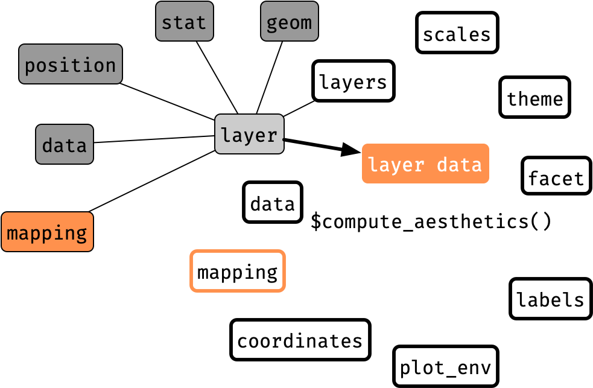
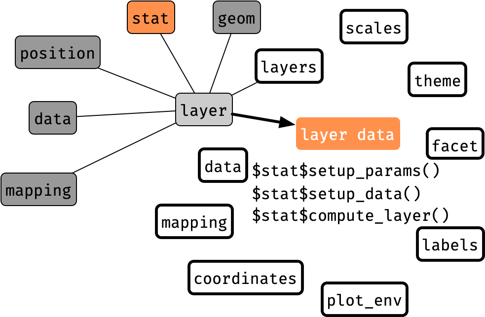
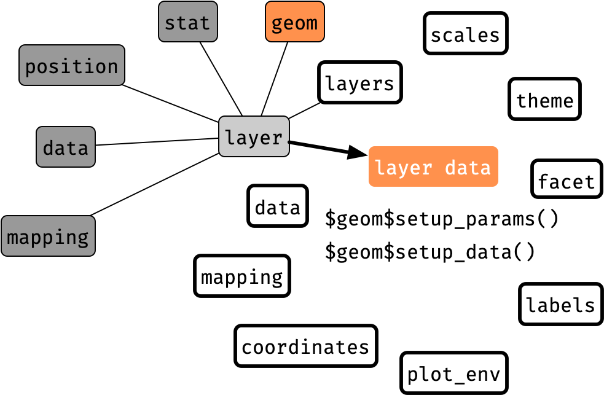
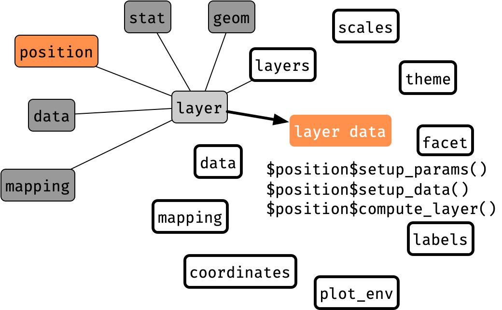
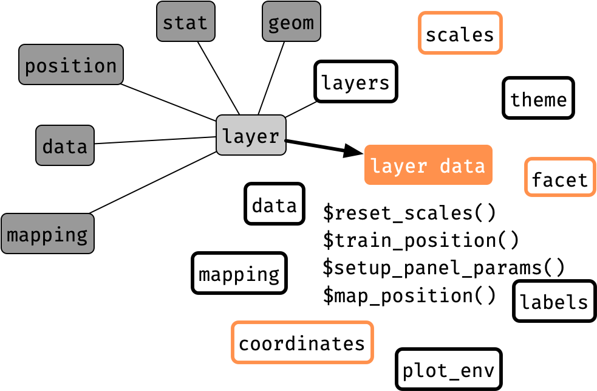
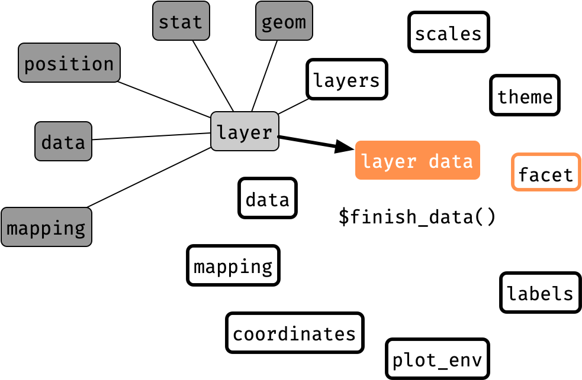

```{r, include = FALSE}
current_file <- knitr::current_input()
figpath <- paste0("images/", gsub("[.]Rmd", "", current_file), "/")
knitr::opts_chunk$set(fig.path = figpath,
                      fig.align = "center",
                      fig.retina = 2, 
                      cache = FALSE,
                      cache.path = "cache/day1-session2/")
library(ggplot2)
theme_set(theme(text = element_text(size = 18)))
source("internals_ggbuild.R")
```
```{r titleslide, child="assets/titleslide.Rmd"}
```

---

layout: true

# Quick overview of `ggplot2`

* `ggplot2` is one of the most popular packages for data visualisation
* It implements an interpretation of the **grammar of graphics** by Wilkinson

.footnote.f5[
H. Wickham. ggplot2: Elegant Graphics for Data Analysis. Springer-Verlag New York, 2016.  
Wilkinson, Leland. 2005. The Grammar of Graphics. Springer. 2nd edition.
]

---

---

count: false

.flex[
.w-50[
```{r plot1, eval = FALSE}
library(ggplot2)
ggplot()
```
]
.w-50[
```{r plot1, echo = FALSE, fig.width = 5.5, fig.height = 5.5}
```
]]

---

count: false


.flex[
.w-50[
```{r plot2, eval = FALSE}
library(ggplot2)
ggplot(data = chickwts, 
       aes(x = weight, 
           y = feed))
```
]
.w-50[
```{r plot2, echo = FALSE, fig.width = 5.5, fig.height = 5.5}
```
]]

---

count: false


.flex[
.w-50[
```{r plot3, eval = FALSE}
library(ggplot2)
ggplot(data = chickwts, 
       aes(x = weight, 
           y = feed)) + 
  geom_violin(aes(color = feed))
```
]
.w-50[
```{r plot3, echo = FALSE, fig.width = 5.5, fig.height = 5.5}
```
]]


---

count: false


.flex[
.w-50[
```{r plot4, eval = FALSE}
library(ggplot2)
ggplot(data = chickwts, 
       aes(x = weight, 
           y = feed)) +
  geom_violin(aes(color = feed)) + 
  geom_boxplot(width = 0.1)
```
]
.w-50[
```{r plot4, echo = FALSE, fig.width = 5.5, fig.height = 5.5}
```
]]

---

.flex[
.w-50[
```{r plot5, eval = FALSE}
library(ggplot2)
ggplot(data = chickwts, 
       aes(x = weight, 
           y = feed)) +
  geom_violin(aes(color = feed)) + 
  geom_boxplot(width = 0.1) +
  scale_x_continuous(trans = "log10")
```
]
.w-50[
```{r plot5, echo = FALSE, fig.width = 5.5, fig.height = 5.5}
```
]]


---

layout: false

# Underlying mechanisms for drawing `ggplot` objects

```{r ggplot-start}
library(ggplot2)
g <- ggplot(data = chickwts, aes(x = weight, y = feed)) +
  geom_violin(aes(color = feed)) + 
  geom_boxplot(width = 0.1) +
  scale_x_continuous(trans = "log10")
```

.flex.mt2[
.w-50[
```{r basic-ggplot, fig.height = 4, fig.width = 6}
print(g)
```


]
.w-50.pl3[

.info-box.animated.bounce[
Drawing in `ggplot2` happens when you **`print` the ggplot object** 
]

{{content}}

]
]


--


* Essentially this involves:

<div class="ggplot-steps">

<ol>
<li><code>data <- ggplot_build(g)</code></li>
<li><code>gtable <- ggplot_gtable(data)</code></li>
<li><code>grid::grid.newpage()</code><br><code>grid::grid.draw(gtable)</code></li>
</ol>
</div>

```{css, echo = FALSE}
.ggplot-steps {
  padding-left: 50px;
}
.ggplot-steps li {
  counter-increment: li;
}
.ggplot-steps  li::marker {
  color: black;
  content: "#" counter(li) "> ";
  font-weight: bold;
}
```

---

# Dissecting the `ggplot` object

```{r strg, eval = FALSE}
str(g)
```
.scroll-sign.h5.f4[
.overflow-scroll.h-100[
```{r strg, echo = FALSE}
```
]
]

<br>

* The `ggplot` object contains:

.flex[
.w-10[
]
.w-20[
* data 
* layers
* scales

]
.w-20[
* mapping 
* theme 
* coordinates 
]
.w-20[
* facet
* plot environment
* labels
]
]


---

class: transition

# \#1> `ggplot_build()`

---

layout: true

.absolute.bottom-0.f5[
Note: this is a rough illustration and some actual processes may differ


]


---


# Data transformation .circle.monash-bg-white.monash-blue[1] _Get the input data_

.flex[
.w-60.center[

]
.w-40[
The data for each layer may be obtained:

1. from the **`data` argument of the layer** where
   * `data` is a `data.frame` or 
   * `data` is a function applied to the global data that returns a `data.frame`
2. by inheriting the **global data specified in `ggplot()`**  

.scroll-sign.f5[
.overflow-scroll.h4[
```{r data-trans1, echo = FALSE}
gb <- ggbuild(g)
lapply(gb$get, tibble::as_tibble)
```
]]

]
]

---

# Data transformation .circle.monash-bg-white.monash-blue[2] _Setup data_

.flex[
.w-60.center[

]
.w-40[

* Adjustments made based on raw input data and plot info
* Initialise panels, add extra data for margins and missing faceting variables, and add on a `PANEL` variable to data


```{css, echo = FALSE}
details .hljs {
  background-color: black!important;
}
```


<details class="f6">
<summary>Click to see difference to the previous data</summary>

.overflow-scroll.h5[
```{r, echo = FALSE}
waldo::compare(gb$get, gb$panel)
```
]


</details>


.scroll-sign.f5[
.overflow-scroll.h5[
```{r data-trans2, echo = FALSE}
lapply(gb$panel, tibble::as_tibble)
```
]]

]
]

---

# Data transformation .circle.monash-bg-white.monash-blue[3] _Compute aesthetics_

.flex[
.w-60.center[

]
.w-40[

* Compute aesthetics to produce data with aesthetics variables
* Variables not specified in mapping are dropped from the data 


<details class="f6">
<summary>Click to see difference to the previous data</summary>

.overflow-scroll.h5[
```{r, echo = FALSE}
waldo::compare(gb$panel, gb$prepared)
```
]

</details>

.scroll-sign.f5[
.overflow-scroll.h5[
```{r data-trans3, echo = FALSE}
lapply(gb$prepared, tibble::as_tibble)
```
]]

]
]

---

# Data transformation .circle.monash-bg-white.monash-blue[4] _Scale transformation_

.flex[
.w-60.center[

]
.w-40[

* The `trans` argument in `scale_*` functions are applied to data here
* Subsequent rendering are based on this transformed space

<details class="f6">
<summary>Click to see difference to the previous data</summary>

.overflow-scroll.h5[
```{r, echo = FALSE}
waldo::compare(gb$prepared, gb$transformed)
```
]

</details>

.scroll-sign.f5[
.overflow-scroll.h5[
```{r data-trans4, echo = FALSE}
lapply(gb$transformed, tibble::as_tibble)
```
]]

]
]

---

# Data transformation .circle.monash-bg-white.monash-blue[5] _Map the position aesthetics_

.flex[
.w-60.center[

]
.w-40[

* Map the position aesthetics using position scales
* These are often the `x` and `y` variables

<details class="f6">
<summary>Click to see difference to the previous data</summary>

.overflow-scroll.h5[
```{r, echo = FALSE}
waldo::compare(gb$transformed, gb$positioned)
```
]

</details>

.scroll-sign.f5[
.overflow-scroll.h5[
```{r data-trans5, echo = FALSE}
lapply(gb$positioned, tibble::as_tibble)
```
]]

]
]

---

# Data transformation .circle.monash-bg-white.monash-blue[6] *Compute and map statistics*

.flex[
.w-60.center[

]
.w-40[

* Compute and map statistics
* Here for the:
  * violin plot: the density among other statistics are calculated,
  * boxplot: the five number summary among other statistics are calculated.

<details class="f6">
<summary>Click to see difference to the previous data</summary>

.overflow-scroll.h5[
```{r, echo = FALSE}
waldo::compare(gb$positioned, gb$poststat)
```
]

</details>

.scroll-sign.f5[
.overflow-scroll.h5[
```{r data-trans6, echo = FALSE}
lapply(gb$poststat, tibble::as_tibble)
```
]]

]
]


---


# Data transformation .circle.monash-bg-white.monash-blue[7] _Reparametrise variables based on geom_

.flex[
.w-60.center[

]
.w-40[

* Reparametrise variables based on the `geom`
* This may include calculating `width`, `ymin`, `ymax` and so on

<details class="f6">
<summary>Click to see difference to the previous data</summary>

.overflow-scroll.h5[
```{r, echo = FALSE}
waldo::compare(gb$poststat, gb$reparametrise)
```
]

</details>


.scroll-sign.f5[
.overflow-scroll.h5[
```{r data-trans7, echo = FALSE}
lapply(gb$reparametrise, tibble::as_tibble)
```
]]

]
]

---

# Data transformation .circle.monash-bg-white.monash-blue[8] *Compute position adjutmnets*

.flex[
.w-60.center[

]
.w-40[

* Compute position adjustments

<details class="f6">
<summary>Click to see difference to the previous data</summary>

.overflow-scroll.h5[
```{r, echo = FALSE}
waldo::compare(gb$reparametrise, gb$geompos)
```
]

</details>


.scroll-sign.f5[
.overflow-scroll.h5[
```{r data-trans8, echo = FALSE}
lapply(gb$geompos, tibble::as_tibble)
```
]]

]
]

---

# Data transformation .circle.monash-bg-white.monash-blue[9] _Retrain position scales_

.flex[
.w-60.center[

]
.w-40[

* Reset position scales
* Re-train and map position once again.

<details class="f6">
<summary>Click to see difference to the previous data</summary>

.overflow-scroll.h5[
```{r, echo = FALSE}
waldo::compare(gb$geompos, gb$reposition)
```
]

</details>

.scroll-sign.f5[
.overflow-scroll.h5[
```{r data-trans9, echo = FALSE}
lapply(gb$reposition, tibble::as_tibble)
```
]]
]]

---

# Data transformation .circle.monash-bg-white.monash-blue[9] _Retrain data based on geom defaults_

.flex[
.w-60.center[

]
.w-40[

* Re-compute data based on geom defaults

<details class="f6">
<summary>Click to see difference to the previous data</summary>

.overflow-scroll.h5[
```{r, echo = FALSE}
waldo::compare(gb$reposition, gb$compute_geom_2)
```
]

</details>

.scroll-sign.f5[
.overflow-scroll.h5[
```{r data-trans10, echo = FALSE}
lapply(gb$compute_geom_2, tibble::as_tibble)
```
]]
]]

---

# Data transformation .circle.monash-bg-white.monash-blue[10] _One more visit to stat_

.flex[
.w-60.center[

]
.w-40[

* Retrain data one more time with stat

<details class="f6">
<summary>Click to see difference to the previous data</summary>

.overflow-scroll.h5[
```{r, echo = FALSE}
waldo::compare(gb$compute_geom_2, gb$finstat)
```
]

</details>

.scroll-sign.f5[
.overflow-scroll.h5[
```{r data-trans11, echo = FALSE}
lapply(gb$finstat, tibble::as_tibble)
```
]]
]]

---

# Data transformation .circle.monash-bg-white.monash-blue[11] _Finale_

.flex[
.w-60.center[

]
.w-40[

* Let Layout modify data before rendering

<details class="f6">
<summary>Click to see difference to the previous data</summary>

.overflow-scroll.h5[
```{r, echo = FALSE}
waldo::compare(gb$finstat, gb$built$data)
```
]

</details>

.scroll-sign.f5[
.overflow-scroll.h5[
```{r data-trans12, echo = FALSE}
lapply(gb$built$data, tibble::as_tibble)
```
]]
]]

---

layout: false

# Output from `ggplot2` build step

```{r build, eval = FALSE}
ggplot_build(g)
```

.scroll-sign.h5.f5[
.overflow-scroll.h-100[
```{r build, echo = FALSE}
```
]]

<br>

* Prepares the **data** for each layer
* **`Layout` object** holding information about the trained coordinate system and facetting 
* Copy of the **plot object** `g` with trained scales

---

class: transition

# \#2> `ggplot_gtable()`


---

# List of grobs in a ggplot object


.flex.mt2[
.w-30[
```{r basic-ggplot, fig.height = 4, fig.width = 6}
```


]
.w-80.pl3.h-100.f5[

```{r gtable, eval = FALSE}
data <- ggplot_build(g)
gtable <- ggplot_gtable(data) #<<
gtable
```
.scroll-sign.h5.f5[
.overflow-scroll.h-100[
```{r gtable, echo = FALSE}
```
]]

<br>

* `gtable` is actually a special type of `grid::gTree`

{{content}}

]
]

.footnote.f5[
Hadley Wickham and Thomas Lin Pedersen (2019). gtable: Arrange 'Grobs' in Tables. R package version 0.3.0.
  https://CRAN.R-project.org/package=gtable

]

--

```{r}
class(gtable)
```

---

# Inspecting `gtable`

.f5[
```{r}
grid::grid.ls(gtable)
```
{{content}}
]

--

```{r force-gtable, eval = FALSE}
gftable <- grid::grid.force(gtable)
grid::grid.ls(gftable)
```


```{r force-gtable, echo = FALSE, fig.show='hide'}
```


---

# Manipulating the `gtable`

* As `gtable` is a `gTree`, you can use the same approach to manipulate it via `grid`

--

* The exact grob names are long (and not easy to predict) in `ggplot2` so we'll use regular expression to find grob paths (via `grep = TRUE`)

```{r}
grid::grid.grep("panel.background", gftable, grep = TRUE)
```

--

* We'll edit the panel background so it has a red border and tilted 30 degrees

```{r}
getable <- grid::editGrob(gftable, gPath = "panel.background", grep = TRUE, 
                          gp = grid::gpar(col = "red"), 
                          vp = grid::viewport(angle = 30))
```

* In another modification, we'll remove the panel background

```{r}
grtable <- grid::removeGrob(gftable, gPath = "panel.background", grep = TRUE)
```


---

class: transition

# \#3> .monash-white[`grid.draw()`]


---

# Resulting edit using `grid` on `gtable` 

.flex.f5[
.w-50[
**Original**

```{r gtable-original, fig.height = 3, fig.width = 6}
grid::grid.draw(gtable)
```

]
.w-50[
**Forced**

```{r gtable-forced, fig.height = 3, fig.width = 6}
grid::grid.draw(gftable)
```

]]
.flex.f5[
.w-50[
**Editted**

```{r gtable-editted, fig.height = 3, fig.width = 6}
grid::grid.draw(getable)
```

]

.w-50[
**Removed**

```{r gtable-removed, fig.height = 3, fig.width = 6}
grid::grid.draw(grtable)
```

]

]
---


class: transition

# Resources

<br>

.f2[Check out also the 3rd edition of the ggplot2 book<br>https://ggplot2-book.org/internals.html]


---


class: exercise middle hide-slide-number


<i class="fas fa-users"></i>

# <i class="fas fa-code"></i> Open `day1-exercise-02.Rmd`

<center>
`r countdown::countdown(15, class = "clock")`
</center>

---


```{r endslide, child="assets/endslide.Rmd"}
```
