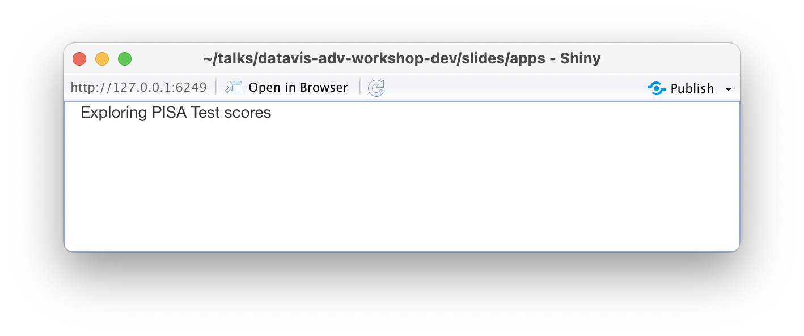

```{r, include = FALSE}
current_file <- knitr::current_input()
```
```{r titleslide, child="assets/titleslide2.Rmd"}
```
```{r, include = FALSE}
knitr::opts_chunk$set(
  fig.path = "images/day2-session1/",
  fig.width = 6,
  fig.height = 4,
  fig.align = "center",
  out.width = "100%",
  fig.retina = 3,
  warning = FALSE,
  message = FALSE,
  cache = FALSE
)
library(tidyverse)
filter <- dplyr::filter
select <- dplyr::select
library(learningtower)
```

---
class: transition middle

# Outline

Mapping out an app
<br>

Choices in packages for apps
<br>

Building a shiny app
<br>


---
# learningtower: PISA Scores

```{r eval=FALSE, echo=FALSE}
student <- load_student("all")
save(student, file=here::here("data/student.rda"))
```

.s500[.font_small[
```{r}
load(here::here("data/student.rda"))
student %>% glimpse()
```
]]

<div class="tag center animated rubberBand" style="position:absolute;top:2%;left:2%;transform:rotate(-3deg);">
demo data for apps
</div>

---
# Mapping out an app

<br>
Your goal is to make the .monash-orange2[analysis easy] for someone without coding skills.

--

<br>Decide on what key insights might be made, and .monash-orange2[structure the app] around these, eg

- How do scores vary between countries?
- Is there a difference between genders?
- Are there trends in scores over time?

--

<br>Keep in mind that an app needs to be .monash-orange2[responsive]. Users need the change to happen very quickly. 

---
# Web apps with R

<br>

There are many options for making web apps using R, including:

- shiny 
- learnr 
- flexdashboard 
- shinydashboard

---
# shiny is...

<br><br>
.flex[
.item[

]
.item[
- an R package that makes it easy to build interactive web apps straight from R. 
- You can also extend your Shiny apps with CSS themes, htmlwidgets, and JavaScript actions.
- It can be used to build dashboards.

]]

---
# learnr is...
.flex[
.item[

]
.item[
- an R package that makes it easy to turn any R Markdown document into an interactive tutorial.
- Tutorials consist of content along with interactive components for checking and reinforcing understanding. 
- Tutorials can include any or all of the following:
    - Narrative, figures, illustrations, and equations.
    - Code exercises (R code chunks that users can edit and execute directly).
    - Quiz questions.
    - Videos (supported services include YouTube and Vimeo).
    - Interactive Shiny components.
]]


---
# flexdashboard is...

.flex[
.item[

]
.item[

- Rmarkdown based, allows multi-page tabbed layouts
- Static dashboards, but can use `shiny` with `runtime: shiny` in the YAML.
- Easy to customise, like writing a regular `html_document`
- Easy to deploy
]]

---
# shinydashboard is...

- `shiny` based but introduces dashboard visual motifs
- Interactive or static dashboards but requires you to know how to set up a `shiny` app
- Harder to customise but could be used to build fully fledged web apps

---
class: transition middle 

# Start with shiny 

---
# Single file: app.r

.left-code[
Create a new directory, and a R script file called `app1.r`, with these contents:

.font_small[
```{r eval=FALSE}
library(shiny)
ui <- fluidPage(
  "Exploring PISA Test scores"
)
server <- function(input, 
                   output, 
                   session) {
}
shinyApp(ui, server)
```
]


]

.right-plot[



.monash-blue2[This app simply writes "Exploring PISA Test scores" into a new window.] 

Alternatively, using the RStudio window, you can create a new app from template. 

Or, you can start from an app that mostly has the features you want for your own app. 

]

---
background-color: #008A25
class: no-header-strip middle 

# `r emo::ji("wrench")` YOUR TURN

<br><br>

In your R Studio window, open `app1.r` file, and click `Run App`. 


---
# App structure

There are two main parts of a shiny app:

- What we see and interact with: <br/><br/>
  - .monash-orange2[user interface (ui)]: layout with user input and (plot) output <br/><br/>
- What is going on underneath: <br/><br/>
  - .monash-orange2[the server]: glue between user input and output

---

# Shiny inputs

Shiny has many different input options, see the [widget gallery](https://shiny.rstudio.com/gallery/widget-gallery.html):

- `actionButton()` - creates a clickable button
- `selectInput()` create a select list 
- `checkboxInput()` and `checkboxGroupInput()`
- `dateInput()` - calendar to select a date
- `dateRangeInput()` - select a range of dates
- `fileInput()` - upload a file
- `numericInput()` - input a numeric value
- `radioButtons()` - select one or more items
- `sliderInput()` - slide along a range of values
- `textInput()` - input a string

---
# Shiny outputs

These are what is drawn, written or shown in your app:

- `renderDataTable()` - outputs an interactive, sortable data table
- `htmlOutput()` - output html elements
- `plotlyOutput()` - output with .monash-blue2[plotly] elements
- `renderPlot()` - output an R plot
- `renderPlotly()` - output .monash-blue2[plotly] interactive plot
- `renderPrint()` - output text from print() in R
- `renderTable()` - output an HTML table
- `renderText()` - output text from R
- `renderUI()` - output a custom part of the user interface
- `renderImage()` - print an image to the page

---
# PISA scores app

.pull-left[
Our app will have these elements:

- .monash-blue2[Purpose]: Compare temporal trend in scores across countries
- .monash-blue2[UI]: 
    - Menu to choose subject: math, read, science
    - Text entry/menu to select country to highlight
- .monash-blue2[Output (server)]: time plots of scores for each country
]

--

.pull-right[
.monash-orange2[Pre-process data] prior to making app, to have smaller, focused data to help with .monash-orange2[responsiveness].

.font_small[
```{r eval=FALSE}
data(countrycode)
student_app <- student %>%
  group_by(year, country) %>%
  summarise(math = weighted.mean(math,
              w=stu_wgt, na.rm=TRUE),
            read = weighted.mean(read,
              w=stu_wgt, na.rm=TRUE),
            science = weighted.mean(science,
              w=stu_wgt, na.rm=TRUE),
            .groups = "drop") %>%
  left_join(countrycode) %>%
  select(year, country_name, math, science, read) %>%
  rename(country = country_name) %>%
  mutate(year = as.numeric(as.character(year)))
save(student_app, file=here::here("data/student_app.rda"))
```
]]


---
background-color: #008A25
class: no-header-strip middle 

# `r emo::ji("wrench")` YOUR TURN

<br><br>

1. In your RStudio Window open and run the `pisa_app`
2. Change the highlight colour and re-run
3. ADVANCED: Change the output to be an interactive plotly


---
# Trouble-shooting

.pull-left[

Tracebacks printed into the Console are your friend. These will pinpoint the location where the code is failing.

```
Error in *: non-numeric argument to binary operator
  169: g [app.R#4]
  168: f [app.R#3]
  167: renderPlot [app.R#13]
  165: func
  125: drawPlot
  111: <reactive:plotObj>
   95: drawReactive
   82: renderFunc
   81: output$plot
    1: runApp
```
]

.pull-right[
Alternatively, you can add `browser()` to any part of the code. This stops at that point and allows you to step through line by line, and check what values are being created.

```
if (input$value == "a") {
  browser()
}
# Or maybe
if (my_reactive() < 0) {
  browser()
}
```
]

---
background-color: #008A25
class: no-header-strip middle

# `r emo::ji("wrench")` YOUR TURN

<br><br>

1. We are going to trouble shoot an error. Change the `selectInput` on line 13 to `menuInput`. 
2. Run the app, and watch the Console window. You should see an error, pointing to line 13. 

---
# Customising with themes and css

A range of pre-made themes is available, and can be viewed [here](https://bootswatch.com/). THese can be applied to your app in the `ui` setup:

```{r eval=FALSE}
ui <- fluidPage(
  theme = 
    bslib::bs_theme(bootswatch = "sandstone"), #<<
  titlePanel("Exploring PISA Test scores"),
```

--

<br><br>
Full control over the design can be done using `css` and a good place to start is [Nick Strayer's RStudio post](https://shiny.rstudio.com/articles/css.html).

---
# Deploying your app

<br><br>
- Sign up for an account on [https://www.shinyapps.io/](https://www.shinyapps.io/)
- Authenticate your account
- You may need to do some setup in your session, e.g. install the library `rsconnect`

---
background-color: #008A25
class: no-header-strip middle

# `r emo::ji("wrench")` YOUR TURN

<br><br>

Have a go at deploying the `pisa_app`

---
# Embedding apps in websites, slides

A .monash-blue2[shiny app] can be embedded into a presentation slide or report using: 

```{r eval=FALSE}
knitr::include_app(
  "https://ebsmonash.shinyapps.io/VICfire/", 
  height = "550px") 
```

<br><br>
A .monash-blue2[standalone interactive graphic] saved to a file can be embedded into a presenation or report using:

`<iframe 
src="images/abs_ply.html" 
width="100%" height="500" 
</iframe>`

Note: The supporting `lib` directory needs to be in the same location as the main file.

---
# Learning more

* https://rmarkdown.rstudio.com/flexdashboard/
* https://rstudio.github.io/shinydashboard/get_started.html
* https://mastering-shiny.org/index.html

---

```{r endslide, child="assets/endslide.Rmd"}
```

